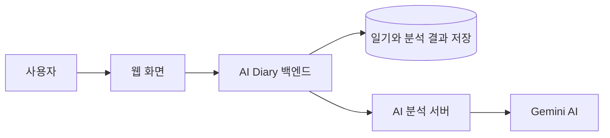

# AI Diary

[](https://github.com/chanwoong00/ai-diary/actions/workflows/ci.yml)

> 하루를 글로 남기면, AI가 마음을 함께 돌아봐 주는 개인 다이어리 서비스입니다.

바쁜 하루를 보내다 보면 내가 어떤 기분으로 지냈는지 놓치기 쉽습니다. AI Diary는 사용자가 일기를 작성하면 Gemini 기반 AI가 글 속 감정을 분석하고, 짧은 공감 피드백과 감정 변화 그래프를 보여줍니다.

## 어떤 서비스인가요?

1. 사용자가 오늘 있었던 일과 마음을 일기로 작성합니다.
2. AI가 일기의 감정을 분석합니다.
3. 기쁨, 슬픔, 분노, 불안, 평온의 점수와 짧은 피드백을 확인합니다.
4. 일기가 쌓이면 최근 마음의 변화를 그래프로 돌아볼 수 있습니다.
5. 연속 기록 일수와 1년 전 오늘의 기록도 확인할 수 있습니다.

```text
오늘의 일기 작성
      ↓
AI가 감정과 피드백 분석
      ↓
오늘의 마음 확인
      ↓
시간이 쌓일수록 감정 흐름 돌아보기
```

## 주요 기능

### 계정과 나만의 기록

- 이메일 회원가입과 로그인
- 내 일기는 나만 조회할 수 있도록 로그인 인증 적용
- 일기 작성, 목록 보기, 상세 보기, 삭제
- 삭제한 일기는 화면과 감정 통계에서 제외

### AI 감정 분석

- Gemini 기반 AI가 일기 본문을 분석
- 대표 감정과 감정 강도(1~5점) 제공
- 기쁨·슬픔·분노·불안·평온 5가지 감정 점수 제공
- 일기 내용에 맞춘 짧은 공감 피드백 제공

### 기록 돌아보기

- 최근 7일 또는 30일 감정 변화 그래프
- 기간별 대표 감정과 평균 감정 점수
- 달력에서 날짜별 일기 확인
- 제목·본문 키워드 검색과 감정별 필터
- 연속 일기 작성일(streak) 확인
- 1년 전 오늘의 일기 돌아보기

## 서비스는 어떻게 동작하나요?



- **웹 화면**: 사용자가 일기를 쓰고 분석 결과를 보는 화면입니다.
- **AI Diary 백엔드**: 로그인, 일기 저장, 조회처럼 서비스의 중심 역할을 합니다.
- **데이터베이스**: 일기와 감정 분석 결과를 저장합니다.
- **AI 분석 서버**: 일기 내용을 Gemini AI에 전달하고 분석 결과를 받습니다.

## 기술 스택

| 구분 | 사용 기술 | 역할 |
| --- | --- | --- |
| Frontend | React, TypeScript, Vite | 사용자가 보는 웹 화면 |
| Backend | Java 17, Spring Boot | 로그인, 일기, 감정 데이터 API |
| Database | MySQL | 사용자·일기·감정 분석 결과 저장 |
| AI | Gemini API, FastAPI, Python | 감정 분석과 공감 피드백 생성 |
| Authentication | JWT, BCrypt | 로그인 상태 확인과 비밀번호 암호화 |
| Documentation | Swagger / OpenAPI | API 사용 설명서와 테스트 화면 |
| CI | GitHub Actions | 코드가 빌드되는지 자동 확인 |

## API 문서

백엔드 서버를 실행한 뒤 아래 주소에서 API 목록과 요청·응답 예시를 확인할 수 있습니다.

```text
http://localhost:8080/swagger-ui/index.html
```

Swagger는 프론트엔드와 백엔드가 주고받는 약속(API)을 한곳에서 확인하고 직접 테스트하는 화면입니다. 로그인 API로 받은 JWT를 `Authorize`에 입력하면, 로그인해야 사용할 수 있는 일기 API도 테스트할 수 있습니다.

## 주요 API

모든 일기·감정·개인 기록 API는 로그인 토큰이 필요합니다.

| Method | Endpoint | 설명 |
| --- | --- | --- |
| POST | `/api/auth/signup` | 회원가입 |
| POST | `/api/auth/login` | 로그인 및 인증 토큰 발급 |
| POST | `/api/diaries` | 일기 작성 |
| GET | `/api/diaries?page=0&size=10` | 일기 목록 조회 |
| GET | `/api/diaries?keyword=카페&emotion=JOY` | 키워드·감정 조건으로 일기 검색 |
| GET | `/api/diaries/{diaryId}` | 일기 상세 조회 |
| DELETE | `/api/diaries/{diaryId}` | 일기 삭제(복구 가능한 소프트 삭제) |
| GET | `/api/diaries/on-this-day` | 정확히 1년 전 오늘의 일기 조회 |
| POST | `/api/diaries/{diaryId}/analyses` | AI 감정 분석 실행 |
| GET | `/api/diaries/{diaryId}/analyses/latest` | 최신 감정 분석 결과 조회 |
| GET | `/api/emotions/trends?days=7` | 최근 7일 또는 30일 감정 변화 조회 |
| GET | `/api/users/me/streak` | 연속 일기 작성일 조회 |

## 구현하며 고민한 점

### 일기 저장과 AI 분석을 분리했습니다

AI 분석에는 몇 초가 걸리거나 일시적으로 실패할 수 있습니다. 그래서 일기는 먼저 저장하고, AI 분석은 별도 요청으로 실행하도록 만들었습니다. AI 분석에 문제가 생겨도 사용자의 일기가 사라지지 않습니다.

### 삭제한 일기는 통계에서 제외합니다

일기는 바로 DB에서 지우지 않고 삭제된 시각을 기록합니다. 이를 소프트 삭제라고 합니다. 사용자가 삭제한 일기가 감정 그래프나 연속 기록 계산에 계속 포함되지 않도록 모든 조회 조건에 반영했습니다.

### 감정은 대표값 하나보다 5가지 점수를 함께 저장합니다

대표 감정만 저장하면 "기쁨" 또는 "불안"처럼 한 가지 결과만 남습니다. AI Diary는 5가지 감정 점수를 함께 저장해 날짜별 변화 그래프, 기간 평균, 대표 감정을 보여줄 수 있도록 설계했습니다.

### 연속 기록은 오늘 또는 어제부터 계산합니다

오늘 아직 일기를 쓰지 않았더라도 어제까지 연속 기록했다면, 기록이 바로 끊겼다고 보지 않습니다. 오늘 또는 어제부터 하루씩 거꾸로 확인해 연속 일수를 계산합니다. 같은 날 일기를 여러 번 작성해도 하루로 계산하며, 삭제한 일기는 제외합니다.

### 검색은 최신 AI 분석 결과를 기준으로 합니다

같은 일기를 다시 분석할 수 있기 때문에 분석 결과가 여러 개 쌓일 수 있습니다. 감정 필터에서는 가장 최근 분석 결과를 기준으로 일기를 찾도록 구현했습니다.

## 로컬에서 실행하기

### 준비물

- Java 17
- MySQL
- Node.js 20 이상
- Python 3.9 이상
- Gemini API Key

### 1. 데이터베이스 만들기

```sql
CREATE DATABASE aidiary
  CHARACTER SET utf8mb4
  COLLATE utf8mb4_unicode_ci;

CREATE USER 'aidiary_app'@'localhost' IDENTIFIED BY 'YOUR_DATABASE_PASSWORD';
GRANT ALL PRIVILEGES ON aidiary.* TO 'aidiary_app'@'localhost';
FLUSH PRIVILEGES;
```

### 2. AI 분석 서버 실행하기

`gemini-experiment/.env` 파일을 만들고 API 키를 설정합니다.

```env
GEMINI_API_KEY=YOUR_GEMINI_API_KEY
GEMINI_MODEL=gemini-3.5-flash-lite
```

```bash
cd gemini-experiment
python3 -m pip install -r requirements.txt
python3 -m uvicorn app:app --port 8000
```

### 3. Spring Boot 백엔드 실행하기

IntelliJ 실행 설정 또는 터미널 환경변수에 아래 값을 설정합니다.

```text
DB_USERNAME=aidiary_app
DB_PASSWORD=YOUR_DATABASE_PASSWORD
JWT_SECRET=LONG_RANDOM_SECRET
GEMINI_API_BASE_URL=http://127.0.0.1:8000
```

```bash
./gradlew bootRun
```

백엔드는 `http://localhost:8080`에서 실행됩니다.

### 4. 웹 화면 실행하기

```bash
cd frontend
npm ci
npm run dev
```

웹 화면은 `http://localhost:5173`에서 실행됩니다.

## 코드 구조

```text
.
├── frontend/                    # 사용자가 보는 React 웹 화면
├── gemini-experiment/           # Gemini를 호출하는 FastAPI 서버
├── src/main/java/com/aidiary/
│   ├── domain/
│   │   ├── user/                # 회원가입, 로그인, 연속 기록
│   │   ├── diary/               # 일기 작성·조회·검색·삭제
│   │   └── emotion/             # AI 분석 결과와 감정 트렌드
│   └── global/                  # JWT, 보안, 예외 처리, Swagger 설정
└── .github/workflows/ci.yml     # 자동 빌드 검사
```

## 코드 품질 확인

GitHub Actions는 `main`과 `feature/**` 브랜치에 코드가 올라오거나 Pull Request를 만들 때 자동으로 실행됩니다.

```text
CI
├── Backend: Java 코드 컴파일 확인
└── Frontend: TypeScript 검사 및 웹 빌드 확인
```

## 역할 분담

| 담당 | 주요 업무 |
| --- | --- |
| 찬웅 | Gemini 프롬프트 설계, FastAPI AI 서버, AI 응답 품질 검증 |
| 민정 | Spring Boot API·DB, JWT 인증, 감정 트렌드, 프론트 연동, CI·배포 준비 |

## 앞으로 할 일

- Docker Compose로 웹 서비스, 백엔드, AI 서버, DB 실행 환경 통일
- 클라우드 배포와 자동 배포(CD) 연결
- API 자동 테스트와 MySQL 통합 테스트 추가
- 사용자가 원할 때만 AI 분석을 받을 수 있는 설정 추가
- 주간 감정 리포트 생성 기능
- 공개 데이터셋 기반 경량 감정 분류 모델과 Gemini 결과 비교

## 보안과 개인정보

- Gemini API Key, DB 비밀번호, JWT Secret은 저장소에 올리지 않습니다.
- 사용자 일기와 계정 정보는 로그인한 본인만 조회할 수 있도록 인증을 적용했습니다.
- AI 감정 분석을 위해 일기 본문이 Gemini API로 전달될 수 있으므로, 실제 서비스 배포 전에는 사용자에게 이를 명확히 안내하고 동의 설정을 추가할 예정입니다.
