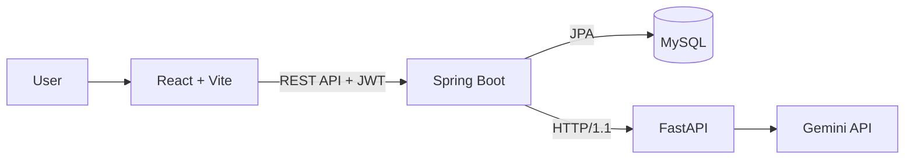

# AI Diary

[](https://github.com/chanwoong00/ai-diary/actions/workflows/ci.yml)

일기를 작성하면 Gemini 기반 AI가 감정을 분석하고, 감정 변화와 피드백을 제공하는 감정 분석 다이어리 서비스입니다.

## 주요 기능

- 이메일 회원가입 / 로그인 및 JWT 인증
- 일기 작성, 목록 조회, 상세 조회, 소프트 삭제
- Gemini 기반 감정 분석 및 피드백 생성
- 기쁨·슬픔·분노·불안·평온 5종 감정 점수 저장
- 최근 7일 / 30일 감정 트렌드 조회
- 감정 리포트: 날짜별 선 그래프, 평균 점수, 대표 감정
- 기록 달력 및 날짜별 일기 탐색

## 서비스 화면 흐름

```text
회원가입 / 로그인
        ↓
일기 작성
        ↓
Spring Boot → FastAPI → Gemini API
        ↓
감정 분석 결과 및 피드백 저장
        ↓
홈 요약 · 감정 리포트 · 기록 달력에서 조회
```

## 아키텍처



## 기술 스택

| 구분 | 기술 |
| --- | --- |
| Frontend | React, TypeScript, Vite |
| Backend | Java 17, Spring Boot, Spring Security, Spring Data JPA |
| Database | MySQL |
| AI | Gemini API, FastAPI, Python |
| Authentication | JWT, BCrypt |
| CI | GitHub Actions |

## 프로젝트 구조

```text
.
├── frontend/                    # React + Vite 프론트엔드
├── gemini-experiment/           # FastAPI 기반 Gemini 연동 서버
├── src/main/java/com/aidiary/
│   ├── domain/
│   │   ├── user/                # 회원가입, 로그인
│   │   ├── diary/               # 일기 CRUD
│   │   └── emotion/             # 분석 결과, 감정 트렌드
│   └── global/                  # JWT, 보안, 예외 처리, Gemini Client
├── src/main/resources/
│   └── application.yml
└── .github/workflows/ci.yml     # GitHub Actions CI
```

## 로컬 실행 방법

### 사전 준비

- Java 17
- MySQL
- Node.js 20 이상
- Python 3.9 이상

### 1. MySQL 데이터베이스 생성

```sql
CREATE DATABASE aidiary
  CHARACTER SET utf8mb4
  COLLATE utf8mb4_unicode_ci;

CREATE USER 'aidiary_app'@'localhost' IDENTIFIED BY 'YOUR_DATABASE_PASSWORD';
GRANT ALL PRIVILEGES ON aidiary.* TO 'aidiary_app'@'localhost';
FLUSH PRIVILEGES;
```

### 2. Gemini FastAPI 서버 실행

`gemini-experiment/.env` 파일을 만들고 Gemini API 키를 설정합니다.

```env
GEMINI_API_KEY=YOUR_GEMINI_API_KEY
GEMINI_MODEL=gemini-3.5-flash-lite
```

```bash
cd gemini-experiment
python3 -m pip install -r requirements.txt
python3 -m uvicorn app:app --port 8000
```

FastAPI 서버는 `http://127.0.0.1:8000`에서 실행됩니다.

### 3. Spring Boot 서버 실행

IntelliJ 실행 설정 또는 터미널 환경변수에 아래 값을 설정합니다.

```text
DB_USERNAME=aidiary_app
DB_PASSWORD=YOUR_DATABASE_PASSWORD
JWT_SECRET=LONG_RANDOM_SECRET
GEMINI_API_BASE_URL=http://127.0.0.1:8000
```

터미널 실행 예시:

```bash
./gradlew bootRun
```

Spring Boot 서버는 `http://localhost:8080`에서 실행됩니다.

### 4. React 프론트엔드 실행

```bash
cd frontend
npm ci
npm run dev
```

프론트엔드는 `http://localhost:5173`에서 실행됩니다. Vite Proxy를 통해 `/api` 요청은 Spring Boot 서버로 전달됩니다.

## 주요 API

모든 일기 및 감정 API는 `Authorization: Bearer {accessToken}` 헤더가 필요합니다.

| Method | Endpoint | 설명 |
| --- | --- | --- |
| POST | `/api/auth/signup` | 회원가입 |
| POST | `/api/auth/login` | 로그인 및 JWT 발급 |
| POST | `/api/diaries` | 일기 작성 |
| GET | `/api/diaries?page=0&size=10` | 일기 목록 조회 |
| GET | `/api/diaries/{diaryId}` | 일기 상세 조회 |
| DELETE | `/api/diaries/{diaryId}` | 일기 소프트 삭제 |
| POST | `/api/diaries/{diaryId}/analyses` | AI 감정 분석 실행 |
| GET | `/api/diaries/{diaryId}/analyses/latest` | 최신 분석 결과 조회 |
| GET | `/api/emotions/trends?days=7` | 최근 N일 감정 트렌드 조회 |

### 감정 트렌드 응답 예시

```json
{
  "days": 7,
  "trends": [
    {
      "date": "2026-10-03",
      "scores": {
        "JOY": 1.0,
        "SADNESS": 2.0,
        "ANGER": 0.0,
        "ANXIETY": 3.0,
        "CALM": 1.0
      }
    }
  ]
}
```

## 주요 설계 결정

### 감정 분석과 일기 저장 분리

일기는 먼저 저장하고, 감정 분석은 별도 API로 실행합니다. 분석 실패가 일기 저장 자체를 실패시키지 않도록 하기 위한 구조입니다.

### 감정 점수 5종 저장

대표 감정과 강도뿐 아니라 5가지 감정 점수를 저장합니다. 이를 통해 일기 상세 점수, 날짜별 감정 변화, 기간 평균 감정 리포트를 만들 수 있습니다.

### 소프트 삭제 데이터 제외

일기는 `deleted_at`을 기록하는 소프트 삭제 방식을 사용합니다. 감정 트렌드 조회 시에는 삭제되지 않은 일기의 분석 결과만 포함합니다.

### 동기 AI 호출 선택

현재 Gemini 분석 응답 시간이 약 5초 수준이므로, 사용자가 저장 직후 분석 결과를 확인할 수 있는 동기 호출 방식을 사용합니다. 호출 지연이나 트래픽 증가 시 비동기 작업 구조로 확장할 수 있습니다.

## CI

GitHub Actions는 `main` 또는 `feature/**` 브랜치 푸시, `main` 대상 Pull Request에서 자동 실행됩니다.

```text
CI
├── Backend compile: ./gradlew compileJava
└── Frontend build: npm ci && npm run build
```

## 역할 분담

| 담당 | 업무 |
| --- | --- |
| 찬웅 | Gemini 프롬프트 설계, FastAPI AI 서버, 모델 검증 |
| 민정 | Spring Boot API/DB, JWT 인증, 감정 트렌드, React 연동, CI/배포 준비 |

## 향후 계획

- Docker Compose로 Spring Boot, FastAPI, MySQL 실행 환경 통일
- 클라우드 배포 및 CD 파이프라인 연결
- API 자동 테스트 및 MySQL 통합 테스트 추가
- 주간 감정 리포트 생성 기능
- 감정별 검색 / 필터 기능
- 공개 데이터셋 기반 경량 감정 분류 모델 비교 실험

## 보안 주의사항

- `.env`, Gemini API Key, DB 비밀번호, JWT Secret은 저장소에 커밋하지 않습니다.
- 실제 서비스 데이터와 사용자 일기 본문은 외부 학습 데이터로 사용하지 않습니다.
